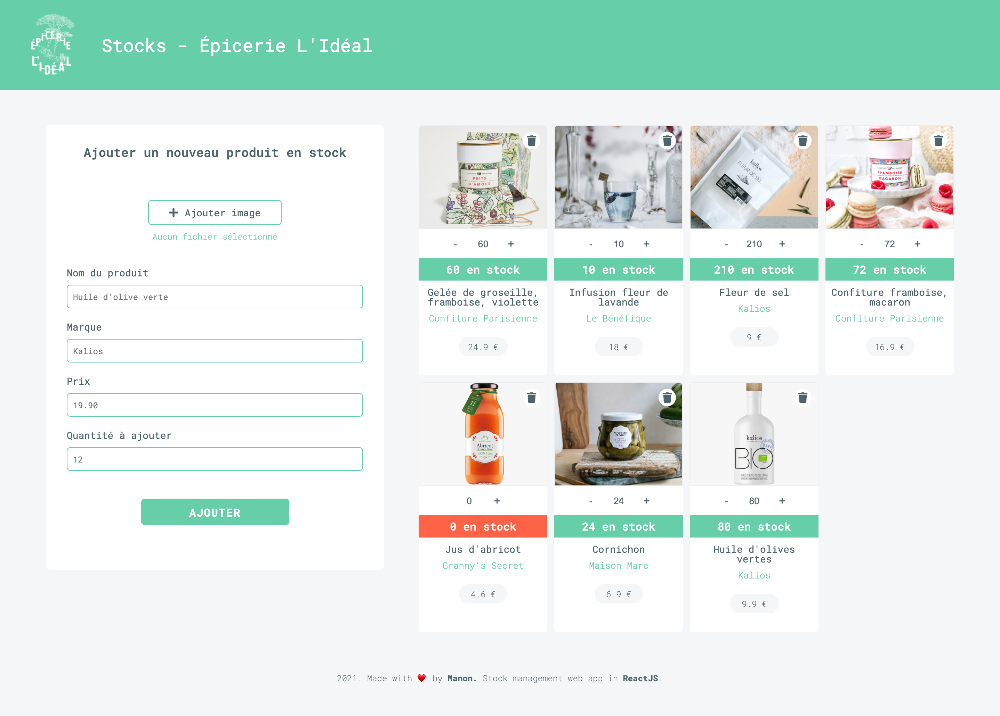
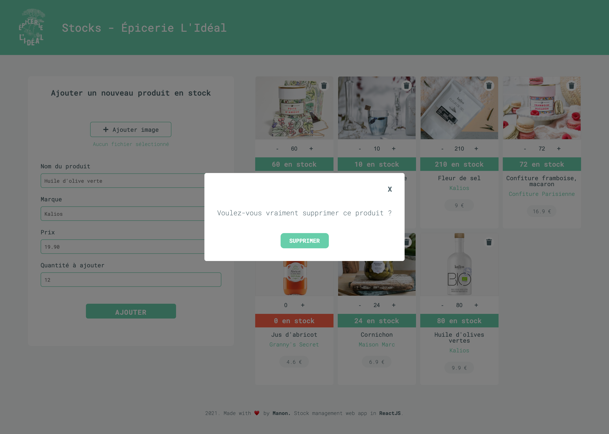
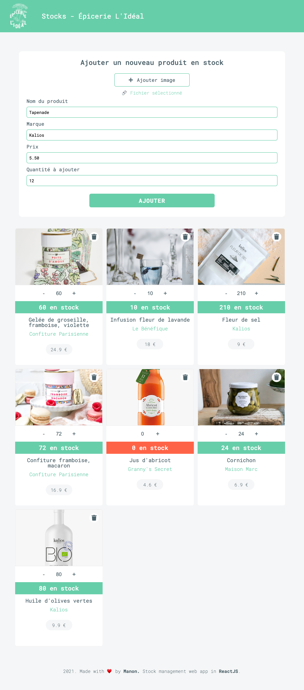
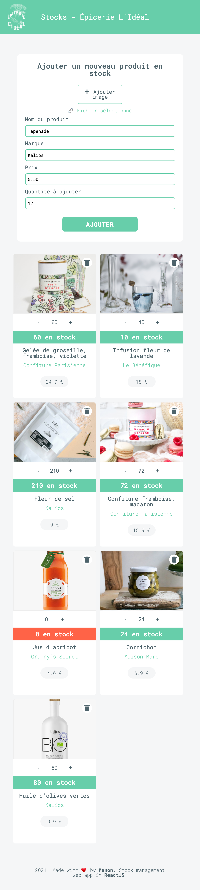

# ÉPICERIE L'IDÉAL - STOCK 📦

🌤 Mai 2021  
✨ Frontend  
⚙️ Backend - check the backend [repo](https://github.com/manon-boiteau/stock-back-Bifrost.git)  
🔗 Netlify - check [that](https://stock-bifrost-2021.netlify.app/)

## 🌈 Overview - Welcome dude

---

Épicerie L'Idéal made for a technical test.  
4 screens are availables according to the responsive design.

  
  
  

## 👩🏻‍💻 Tasks

---

✘ Make layout  
✘ Add a product to the stock (form & counter)  
✘ Delete a product from the stock  
✘ Implement a modal  
✘ Make responsive design

## 📚 Stacks

---

[Javascript](https://www.w3schools.com/js/default.asp)  
[ReactJS](https://fr.reactjs.org/docs/getting-started.html)  
[HTML5](https://www.w3schools.com/html/default.asp)  
[CSS3](https://www.w3schools.com/css/default.asp)

## To be continued

---

✘ Search bar (filter products, sort products)  
✘ Update informations of a product (title, picture, price)

## 🗝 Installation and usage

---

Be sure, you have installed all dependencies and applications to run the project on your computer.

### 🚙 Running the project

1️. Clone this repository

`git clone https://github.com/manon-boiteau/stock-front-Bifrost.git`  
`cd stock-front-Bifrost`

2️. Install packages

`npm install`  
or  
`yarn`

3️. When installation is complete:

`yarn start`
