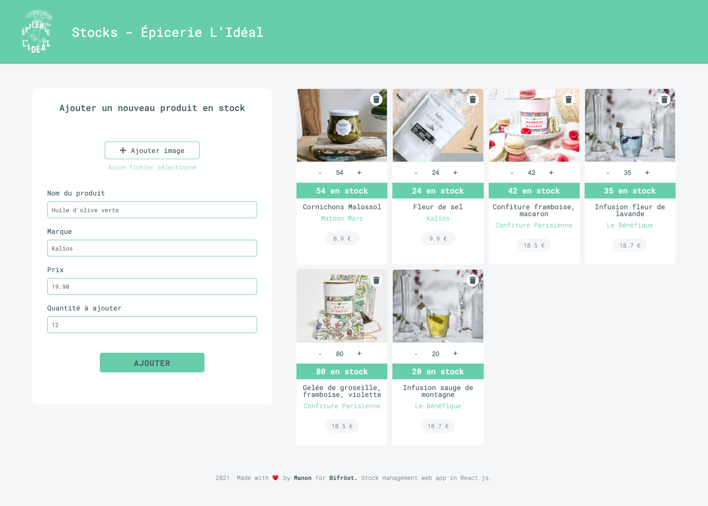
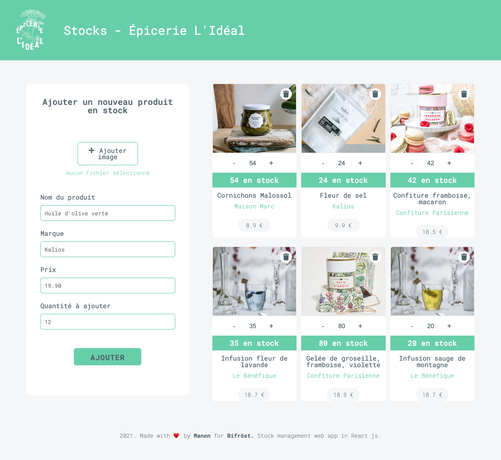
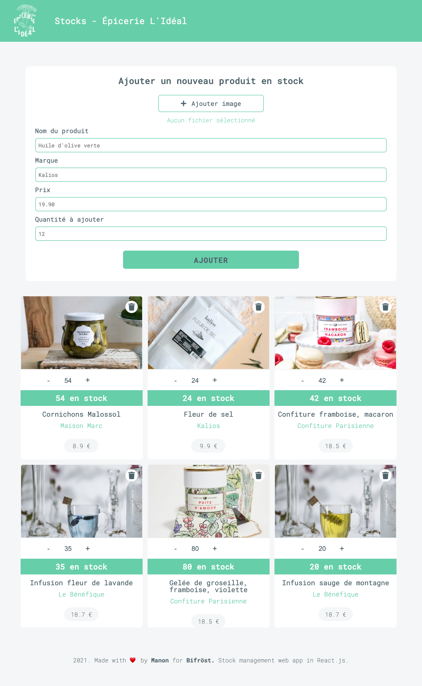
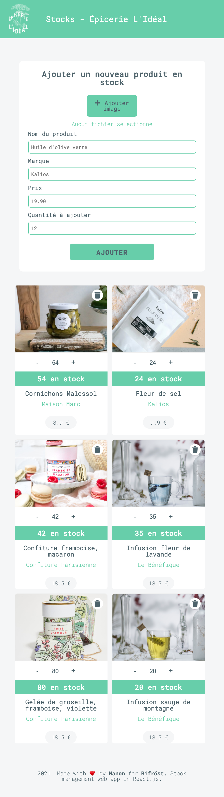

# stock-management-bifrost

🗓 May 2021  
🪄 Frontend - stock management web app  
👉🏻 Check here (work in progress)  
👀 Look at the backend repo!

## Welcome in my stock management project for Bifröst

### My work?

To code the frontend of a stock management web app.

- Create a product
- Read all the products
- Add a quantity
- Remove a quantity
- Delete a product

### To fixed

The main problem I had, was the reload of the page. It does not work yet and after every action on the page we do refresh it manually.

### To be continued

- Search bar (filter products, sort products)
- Update informations of a product (title, picture, price)

### Stacks

- JavaScript, React.js
- HTML5, CSS3
